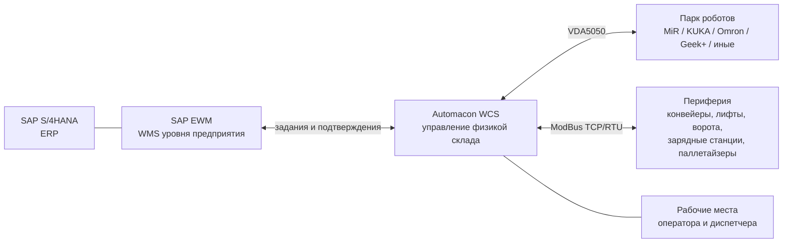
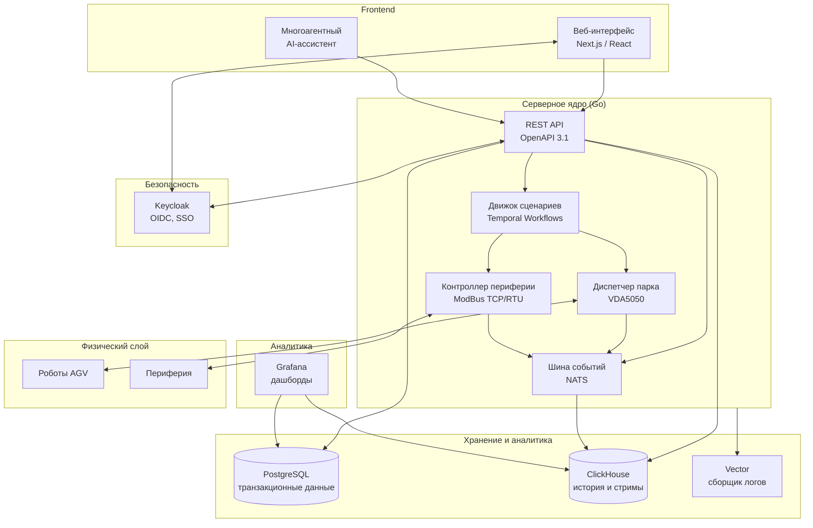
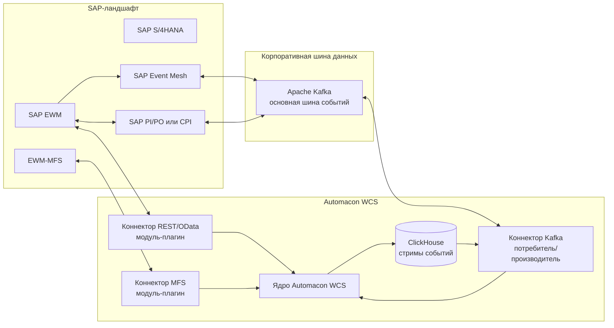
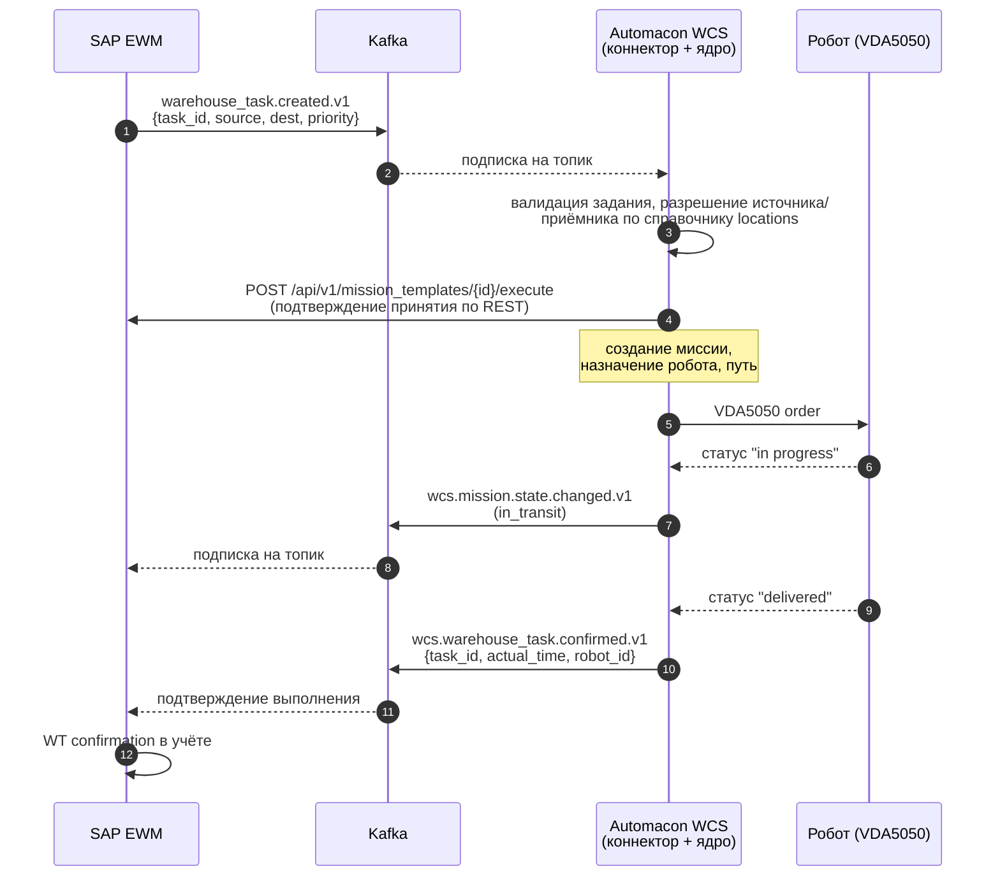
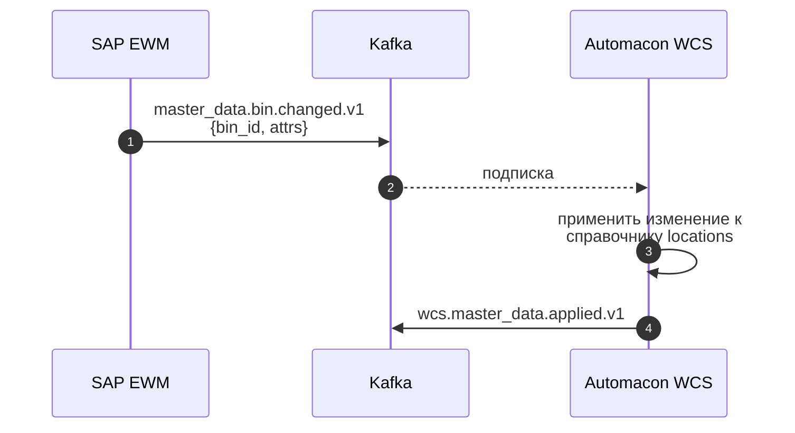
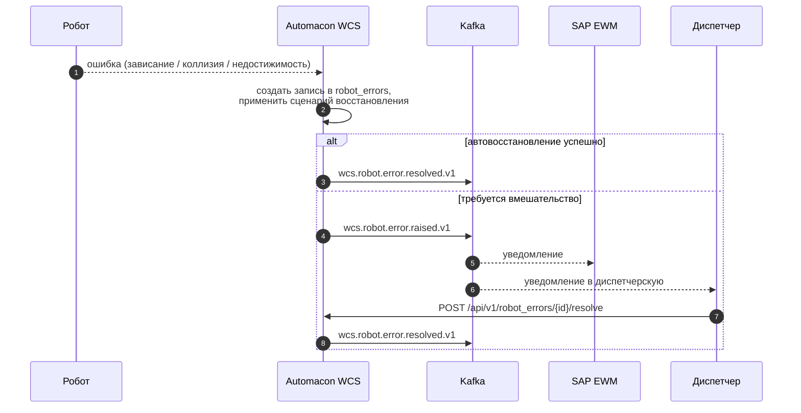
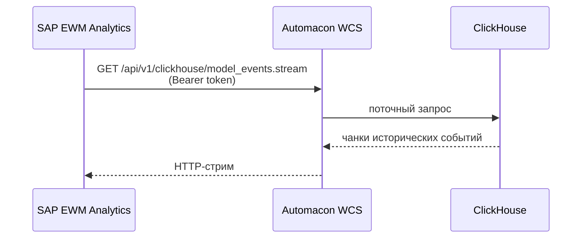
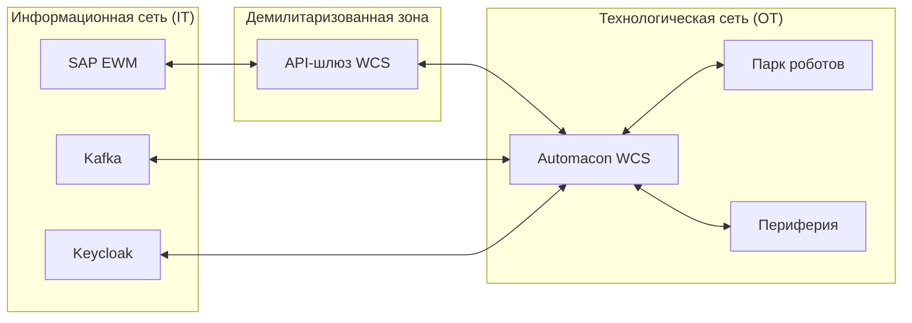

# Архитектура программного обеспечения Automacon WCS и схемы интеграции с SAP EWM

Документ описывает архитектуру платформы **Automacon WCS** (Warehouse Control System) и рекомендуемые схемы её интеграции с **SAP EWM** (Extended Warehouse Management). Материал ориентирован на архитектурный совет проекта внедрения, системных архитекторов корпоративных систем заказчика и команду интеграции SAP-стека.

Документация по программному интерфейсу платформы — `http://89.169.189.227:9000/swagger#/` (заголовок API: **ARMS API**, версия 1.0.0; путь сервера `api/v1`). В тексте документа конкретные ресурсы и методы цитируются с этого источника.

---

## 1. Назначение и контекст

### 1.1. Роль WCS в ИТ-ландшафте

В корпоративном ИТ-ландшафте у систем управления складом разные уровни ответственности:

- **WMS (Warehouse Management System), включая SAP EWM** — система управления складом уровня предприятия. Хранит мастер-данные (товары, ячейки, упаковки, поставщики), формирует складские задания (Warehouse Tasks), управляет волнами, отслеживает запасы, отвечает за пополнение, инвентаризацию, планирование смен.
- **WCS (Warehouse Control System), Automacon WCS** — система управления физическим оборудованием склада: автономными транспортными роботами, конвейерами, лифтами, воротами, зарядными станциями, паллетайзерами и другой периферией. WCS превращает абстрактные задания в согласованные команды конкретного оборудования и подтверждает фактическое выполнение.

WCS не подменяет EWM и не дублирует её функциональность. WCS принимает от EWM «что и куда», добавляет «как именно физически» и возвращает «факт выполнения и его измерения».

### 1.2. Принципы архитектуры платформы

При проектировании Automacon WCS соблюдены следующие принципы:

1. **Открытость интеграций.** Все функции платформы доступны через документированный программный интерфейс REST со стандартом OpenAPI 3.1.
2. **Развёртывание в инфраструктуре заказчика.** Платформа работает во внутреннем периметре, без обязательной зависимости от внешних облачных сервисов.
3. **Расширяемость через модули-плагины.** Сценарные узлы и интеграционные коннекторы реализованы как отдельные сервисы, добавляются без перекомпиляции ядра.
4. **Готовность к высоким нагрузкам.** Подтверждена стабильность парка из 1 000 одновременно работающих роботизированных устройств.
5. **Полная воспроизводимость состояния.** Все события платформы сохраняются в ClickHouse и доступны для воспроизведения на любой момент в прошлом.
6. **Безопасность по умолчанию.** Ролевая модель доступа на уровне записей; авторизация через Keycloak (OIDC) и токены доступа.

---

## 2. Архитектура программного обеспечения Automacon WCS

### 2.1. Высокоуровневая схема компонентов

### 2.2. Основные компоненты

| Слой | Компонент | Технология | Назначение |
|---|---|---|---|
| Клиент | Веб-интерфейс | Next.js (React) | Рабочие места оператора, диспетчера, инженера, технического руководителя; редактор карт; конструктор сценариев. |
| Клиент | Многоагентный AI-ассистент | Внутренний модуль платформы | Запросы на естественном языке, каталог навыков, контекстная навигация по подсистемам. |
| Серверное ядро | REST API | Go | Точка единого входа для внешних систем и веб-интерфейса. Документация — OpenAPI 3.1, путь `api/v1`. |
| Серверное ядро | Движок сценариев | Temporal Workflows | Исполнение визуальных сценариев платформы: ветвления, циклы, подпроцессы, ожидания, программируемые блоки JavaScript. |
| Серверное ядро | Диспетчер парка | Внутренний компонент Go, протокол VDA5050 | Подключение роботов разных производителей, назначение задач, контроль трафика, обработка ошибок. |
| Серверное ядро | Контроллер периферии | Внутренний компонент Go, протокол ModBus TCP/RTU | Подключение конвейеров, лифтов, ворот, зарядных станций, индикаторов, технологических датчиков. |
| Серверное ядро | Шина событий | NATS | Внутренняя асинхронная шина: события подсистем, изменения состояний, выходные сообщения для интеграций. |
| Хранение | Транзакционная база | PostgreSQL | Конфигурация платформы, мастер-данные, текущее состояние сущностей. |
| Хранение | Историческая база и потоки | ClickHouse | История всех событий, потоковые точки `*/stream` и текущие состояния `*/last`. |
| Эксплуатация | Сборщик логов и метрик | Vector | Сбор и доставка журналов и метрик в подсистему наблюдаемости. |
| Эксплуатация | Аналитика | Grafana | Системные и аналитические дашборды, KPI, тренды, отчёты по соглашениям об уровне обслуживания. |
| Безопасность | Identity Provider | Keycloak | Единая точка авторизации (OIDC), интеграция с корпоративным каталогом пользователей. |

### 2.3. Логические сущности платформы

Состав объектной модели по разделам ARMS API. В скобках указаны теги OpenAPI, по которым можно найти соответствующие методы.

| Сущность | Назначение |
|---|---|
| **Карты, точки, рёбра, локации** (`maps`, `points`, `lanes`, `locations`, `location_types`) | Картографическая основа склада: графы движения, точки маршрутов, складские локации. Импорт и экспорт LIF/GeoJSON через `POST /maps/import`, `POST /maps/{id}/export`, `GET /maps/{id}/geojson`. |
| **Шаблоны миссий** (`mission_templates`, `mission_template_versions`, `mission_node_groups`, `mission_nodes`) | Многократно используемые сценарии работы парка. Запуск выполнения — `POST /mission_templates/{id}/execute`. |
| **Миссии** (`missions`, `temporal_workflows`) | Конкретные исполнения сценариев. Каждая миссия — экземпляр Temporal Workflow со своей историей. |
| **Транспортные ордера и заказы** (`transport_orders`, `orders`) | Низкоуровневые команды перемещения от диспетчера к роботам. |
| **Действия и немедленные действия** (`node_action_types`, `instant_action_types`, `instant_actions`, `instant_actions_requests`) | Атомарные операции внутри сценариев и команды немедленного исполнения. |
| **Парк роботов и шаблоны устройств** (`robots`, `manufacturers`, `device_templates`) | Конфигурация подключённых роботов с привязкой к производителям. |
| **Периферия** (`devices`, `chargers`, `palletizers`, `data_objects`) | Конфигурация подключённых ModBus-устройств и их объектов данных. |
| **Ошибки** (`robot_errors`) | Журнал ошибок роботов с возможностью разрешения через `POST /robot_errors/{id}/resolve`. |
| **Сообщения подсистем** (`vda_messages`, `device_messages`, `model_events`) | Потоковые исторические данные ClickHouse и их «последние» снимки. |
| **Безопасность** (`auth`, `access_tokens`, `users`, `roles`, `groups`) | Аутентификация через Keycloak, выпуск токенов доступа, ролевая модель. |
| **Дашборды и папки** (`dashboards`, `folders`) | Конфигурация рабочих мест и каталогизация. |
| **Промпты и вложения** (`prompts`, `attachments`) | Артефакты ассистента и файлы (например, фотографии планов помещений для растрового слоя карт). |

### 2.4. Программный интерфейс (REST + потоковые точки)

Программный интерфейс Automacon WCS состоит из двух частей.

**Запрос-ответ (REST).** Стандартные методы `GET / POST / PATCH / DELETE` над всеми сущностями. Семантика ресурсов соответствует REST: коллекции, элементы коллекций, действия (например, `mission_templates/{id}/execute`, `robot_errors/{id}/resolve`).

**Потоковые подписки.** Для подсистем VDA5050, ModBus и общей модели состояния платформа предоставляет HTTP-стримы из ClickHouse и точки получения «последнего» состояния:

- `GET /clickhouse/vda_messages.stream` — поток сообщений VDA5050 от роботов;
- `GET /clickhouse/vda_messages/last` — последнее состояние VDA5050;
- `GET /clickhouse/device_messages.stream` — поток сообщений ModBus-устройств;
- `GET /clickhouse/device_messages/last` — последнее состояние ModBus;
- `GET /clickhouse/model_events.stream` — поток модельных событий платформы;
- `GET /clickhouse/model_events/last` — последний снимок модельных событий.

Эти точки — естественный шлюз для подписки внешних систем (включая SAP EWM) на события склада в близком к реальному времени режиме.

### 2.5. Безопасность

- **Аутентификация — OpenID Connect через Keycloak.** Точки `/auth/login`, `/auth/callback`, `/auth/refresh`, `/auth/logout`, `/auth/token`. Для интерфейсных сессий используется механизм cookie + bearer-токен; для серверных интеграций — токены доступа.
- **Токены доступа для серверных систем — `/access_tokens`.** Токен выпускается под ответственного за интеграцию, метится меткой и отзывается через `DELETE /access_tokens/{id}`.
- **Ролевая модель доступа.** Объекты: пользователи (`users`), роли (`roles`), группы (`groups`). Разграничение работает на уровне записей: для интеграции с EWM выпускается отдельная сервисная роль с правами ровно на нужные ресурсы.
- **Журналирование действий.** Все вызовы программного интерфейса фиксируются в ClickHouse и доступны для аудита.

---

## 3. Архитектурный контекст SAP EWM

### 3.1. Возможные каналы интеграции SAP EWM с внешними системами

SAP EWM поддерживает несколько способов взаимодействия с внешними системами. Все они применимы для интеграции с WCS, отличаются протоколом, скоростью реакции и зрелостью.

| Канал | Транспорт | Формат | Назначение |
|---|---|---|---|
| **EWM-MFS (Material Flow System)** | TCP/IP, постоянное соединение | Бинарные «телеграммы» фиксированного формата | Канонический способ интеграции с управляющими контроллерами автоматики (PLC, краны-штабелёры, конвейеры). |
| **REST / OData через SAP Gateway** | HTTPS | OData (REST + JSON/XML) | Современный путь, рекомендуемый SAP в S/4HANA. |
| **IDoc через SAP PI / PO / CPI** | Сообщения через шину | XML (IDoc) | Асинхронный обмен документами; высокая надёжность доставки. |
| **SAP Event Mesh / Kafka** | Брокер сообщений | Cloud Events / собственная схема | Событийная интеграция в мультисистемных ландшафтах. |
| **RFC / BAPI** | Удалённый вызов функций ABAP | Типизированные параметры | Низкоуровневые точечные сценарии. |

### 3.2. Что фактически передаётся между EWM и WCS

Независимо от выбранного транспорта, состав данных близок:

**От EWM к WCS:**

- складские задания (Warehouse Tasks): источник, приёмник, груз, приоритет, окно времени, корреляция с волной;
- мастер-данные: ячейки, складские локации, маршрутные карты, типы грузов, ограничения;
- управление волнами и приоритетами в течение смены;
- команды отмены, блокировки и переназначения заданий.

**От WCS к EWM:**

- подтверждения выполнения заданий (Warehouse Task Confirmation) с фактическим временем и исполнителем;
- промежуточные статусы (взято с источника, в пути, доставлено, не доставлено);
- ошибки и нештатные ситуации с привязкой к роботу и заданию;
- телеметрия и измерения для аналитики (опционально).

---

## 4. Рекомендуемая архитектура интеграции WCS ↔ SAP EWM

### 4.1. Общая схема

Для типового промышленного внедрения рекомендуется **комбинированная схема** из трёх каналов: оперативный синхронный канал (REST/OData), событийный канал (Kafka либо SAP Event Mesh) и транспортный модуль для существующей автоматики (MFS-телеграммы — точечно, при наличии унаследованной интеграции у заказчика).

### 4.2. Канал 1. REST/OData — оперативный синхронный контур

**Назначение.** Запросы и подтверждения, требующие синхронного ответа: создание миссии в WCS по полученному заданию, чтение состояния задания, выгрузка справочников.

**Направление вызовов.** В обе стороны:

- **EWM → WCS** для запуска и контроля исполнения.
- **WCS → EWM** для синхронного подтверждения и обновления статуса.

**Привязка к ресурсам ARMS API:**

| Действие | Ресурс ARMS API | Метод |
|---|---|---|
| Запуск миссии по шаблону | `mission_templates/{id}/execute` | POST |
| Создание разовой миссии | `missions` | POST |
| Получение списка миссий | `missions` | GET |
| Получение конкретной миссии | `missions/{id}` | GET |
| Получение списка транспортных ордеров | `transport_orders`, `orders` | GET |
| Чтение справочника роботов | `robots` | GET |
| Чтение справочника локаций | `locations` | GET |
| Чтение точек и рёбер карты | `points`, `lanes` | GET |
| Получение карты в GeoJSON | `maps/{id}/geojson` | GET |
| Журнал ошибок | `robot_errors` | GET |
| Закрытие ошибки | `robot_errors/{id}/resolve` | POST |
| Немедленное действие | `instant_actions_requests` | POST |

**Авторизация.** Bearer-токен, выпущенный через `/access_tokens` под сервисную роль для интеграции с EWM. Токен хранится в средстве хранения секретов на стороне SAP-ландшафта и периодически ротируется.

### 4.3. Канал 2. Kafka (или SAP Event Mesh) — событийный контур

**Назначение.** Асинхронная подписка обеих сторон на события друг друга. WCS получает события создания и изменения заданий из EWM, EWM получает события выполнения и инцидентов от WCS.

**Топология топиков Kafka (рекомендация).**

| Топик | Производитель | Потребитель | Назначение |
|---|---|---|---|
| `sap.ewm.warehouse_task.created.v1` | SAP EWM | Automacon WCS | Создание складского задания. |
| `sap.ewm.warehouse_task.updated.v1` | SAP EWM | Automacon WCS | Изменение приоритета, окна времени, отмена. |
| `sap.ewm.master_data.bin.changed.v1` | SAP EWM | Automacon WCS | Изменение мастер-данных ячеек и локаций. |
| `wcs.mission.created.v1` | Automacon WCS | SAP EWM | Создание миссии в WCS под полученное задание. |
| `wcs.mission.state.changed.v1` | Automacon WCS | SAP EWM | Изменение состояния миссии (взято, в пути, доставлено). |
| `wcs.warehouse_task.confirmed.v1` | Automacon WCS | SAP EWM | Подтверждение выполнения с фактическим временем и исполнителем. |
| `wcs.robot.error.raised.v1` | Automacon WCS | SAP EWM, мониторинг | Появление ошибки робота с привязкой к заданию. |
| `wcs.robot.error.resolved.v1` | Automacon WCS | SAP EWM, мониторинг | Закрытие ошибки. |
| `wcs.telemetry.sample.v1` | Automacon WCS | Аналитика, отчётность | Производственная телеметрия (опционально, для KPI). |

**Формат сообщений.** Cloud Events 1.0 с полезной нагрузкой в JSON. Обязательные атрибуты:

- `id` — уникальный идентификатор события;
- `source` — источник (`sap.ewm` либо `automacon.wcs`);
- `type` — тип события (соответствует имени топика);
- `time` — отметка времени в UTC;
- `subject` — идентификатор объекта (например, идентификатор задания EWM);
- `correlation_id` — сквозной идентификатор для трассировки между системами;
- `data_schema` — ссылка на JSON Schema полезной нагрузки.

**Гарантии доставки.** Для критичных топиков (создание задания, подтверждение выполнения) — режим «не менее одного раза» с идемпотентностью на стороне потребителя по `correlation_id`. Для телеметрии — допустимо «не более одного раза».

**Альтернатива для чисто SAP-ориентированных ландшафтов — SAP Event Mesh.** Архитектурно эквивалентно Kafka; в этом случае коннектор Kafka на стороне Automacon WCS заменяется на коннектор Event Mesh, остальная схема не меняется.

### 4.4. Канал 3. EWM-MFS — точечно для унаследованной автоматики

**Когда применять.** На площадках, где у заказчика уже работает встроенный в EWM Material Flow System и подключённая через MFS автоматика (краны-штабелёры, автоматические конвейеры). В этом случае Automacon WCS подключается как ещё одна MFS-совместимая внешняя система; интеграция строится на стандартном стеке EWM, без переключения на новые транспорты.

**Реализация.** Отдельный модуль-плагин на стороне Automacon WCS с TCP-сервером, обрабатывающим телеграммы EWM-MFS. Преобразование телеграмм в внутренние сообщения NATS — в коннекторе.

### 4.5. Альтернативные и дополнительные каналы

- **IDoc через SAP PI/PO/CPI** — для пакетных асинхронных потоков (например, ежесменные сводки выполнения, отчётность). Реализуется в виде шлюза на стороне корпоративной шины: Kafka ↔ IDoc.
- **RFC / BAPI** — для нишевых сценариев, не покрытых REST и событиями (например, специфические отчёты ABAP). Подключается отдельным адаптером на стороне SAP-ландшафта.

---

## 5. Сквозные интеграционные потоки

### 5.1. Поток «Задание EWM → выполнение в WCS → подтверждение»

**Ключевые моменты потока:**

1. EWM публикует задание в топик `sap.ewm.warehouse_task.created.v1`. Полезная нагрузка содержит уникальный `task_id`, идентификаторы источника и приёмника, груз, приоритет, окно времени, номер волны.
2. Automacon WCS принимает событие, валидирует поля, разрешает идентификаторы локаций по справочнику (`GET /api/v1/locations`).
3. WCS запускает миссию через `POST /api/v1/mission_templates/{id}/execute` или создаёт разовую миссию через `POST /api/v1/missions` — в зависимости от типа задания.
4. Промежуточные статусы публикуются в топик `wcs.mission.state.changed.v1` для прозрачности на стороне EWM.
5. По факту доставки WCS публикует `wcs.warehouse_task.confirmed.v1` с фактическим временем и идентификатором робота.
6. EWM фиксирует подтверждение в учёте.

### 5.2. Поток «Изменение мастер-данных EWM → синхронизация в WCS»

**Что синхронизируется:** ячейки, складские локации, типы грузов, маршрутные ограничения. Полная карта склада в WCS остаётся отдельной сущностью (`maps`), но идентификаторы локаций единые с EWM.

### 5.3. Поток «Ошибка робота → эскалация в EWM»

**Связанные ресурсы ARMS API:**

- `GET /api/v1/robot_errors` — журнал ошибок;
- `POST /api/v1/robot_errors/{id}/resolve` — закрытие ошибки;
- стрим `GET /api/v1/clickhouse/vda_messages.stream` — диагностические данные по протоколу VDA5050.

### 5.4. Поток «Подписка EWM на телеметрию через ClickHouse-стрим»

Для аналитических целей EWM (или подсистема EWM Analytics) может подписаться напрямую на потоки исторических событий WCS, минуя Kafka:

Полезно для отчётов по KPI (например, среднее время цикла, количество доставок в час), которые формируются на стороне EWM или корпоративной аналитической системы.

---

## 6. Гранулярность и идемпотентность

### 6.1. Корреляция между сущностями

Для каждой пары «задание EWM ↔ миссия WCS» применяется сквозной идентификатор `correlation_id`. Возможны три привязки:

1. `correlation_id = warehouse_task_id` — самый простой случай, одна задача EWM = одна миссия WCS.
2. `correlation_id = wave_id` — на сцены с волнами комплектации, одна волна = много миссий, привязанных к ней.
3. Составной идентификатор — для сложных сценариев с несколькими роботами на одну операцию.

Корреляция фиксируется в полезной нагрузке Cloud Events и в полях миссии WCS в `data_objects` (схема расширения для проектных метаданных).

### 6.2. Идемпотентность приёма

Все интеграционные сообщения должны быть идемпотентны на стороне получателя:

- **На стороне WCS:** при повторной доставке `warehouse_task.created.v1` с тем же `task_id` миссия не создаётся повторно. Проверка — по полю `correlation_id` в `data_objects` миссии.
- **На стороне EWM:** при повторной доставке `warehouse_task.confirmed.v1` подтверждение применяется один раз. Проверка — по `correlation_id` и состоянию задания.

### 6.3. Реакция на сбои

| Сбой | Поведение |
|---|---|
| Недоступен брокер Kafka | Сообщения накапливаются во внутренних очередях обеих сторон; после восстановления — массовая доставка. |
| Недоступна EWM при попытке REST-вызова из WCS | Запрос ставится в очередь повтора с экспоненциальной задержкой; параллельно событие публикуется в Kafka как «событие первого порядка». |
| Недоступна WCS при попытке REST-вызова из EWM | EWM фиксирует попытку, повторяет по своему расписанию; Kafka-канал работает независимо. |
| Расхождение состояний после восстановления | Реконсиляция через ежедневное чтение `transport_orders`, `missions`, `warehouse_tasks` за период. |

---

## 7. Безопасность и сетевая архитектура

### 7.1. Сетевая сегментация

Рекомендуемая трёхзонная схема:

**Принципы сегментации.**

- Прямой доступ из EWM в OT-сегмент исключён; вся синхронная коммуникация — через API-шлюз в DMZ.
- Брокер Kafka размещается в IT-сегменте; коннектор WCS подключается к нему изнутри OT-сегмента по выделенному маршруту с двусторонним TLS.
- Keycloak — в IT-сегменте; WCS пользуется им через защищённый канал.
- Парк роботов и периферия физически не имеют доступа в IT-сегмент.

### 7.2. Аутентификация и шифрование

- **Транспорт.** TLS 1.2+ для всех каналов: REST/OData, Kafka (через SASL_SSL), MFS (через TLS-обёртку при наличии возможности у EWM).
- **Аутентификация серверов.** Взаимный TLS (mTLS) на уровне Kafka и REST API между EWM и WCS.
- **Аутентификация пользователей.** OIDC через Keycloak; обязательная многофакторная аутентификация для административных учётных записей.
- **Сервисные токены WCS.** Выпускаются через `POST /api/v1/access_tokens`, метятся меткой интеграции (например, `sap-ewm-prod`), хранятся в средстве хранения секретов SAP-ландшафта (например, SAP Credential Store), ротируются на регулярной основе.

### 7.3. Авторизация (RBAC)

В Automacon WCS для интеграции выпускается отдельная сервисная роль с ограниченным набором прав:

- чтение и запуск шаблонов миссий: `mission_templates: read, execute`;
- чтение и создание миссий: `missions: read, create`;
- чтение справочников: `robots: read`, `locations: read`, `points: read`, `lanes: read`, `maps: read`;
- чтение и закрытие ошибок: `robot_errors: read, resolve`;
- чтение потоковых стримов ClickHouse;
- запрет на изменение карт, шаблонов устройств, ролевой модели.

Принцип минимально необходимых прав соблюдается на уровне записей: интеграционная учётная запись видит ровно те объекты, на которые ей выдан доступ.

---

## 8. Развёртывание и эксплуатация интеграции

### 8.1. Контуры

Стандартное развёртывание включает три контура:

1. **Тестовый контур (DEV/TEST).** Инструмент разработки коннекторов и сценариев. Использует тестовую систему EWM (если доступна) или эмулятор EWM.
2. **Предпромышленный контур (UAT).** Пилот интеграции на ограниченном парке. Подключается к копии продуктивной EWM либо к специальному UAT-контуру SAP.
3. **Промышленный контур (PROD).** Реальная эксплуатация. Подключение к продуктивной EWM.

### 8.2. Версионирование интерфейсов

- **REST API ARMS** версионируется через путь (`/api/v1`, `/api/v2`); обратная совместимость сохраняется в рамках мажорной версии.
- **Kafka-топики** версионируются через суффикс (`.v1`, `.v2`); параллельная работа двух версий поддерживается на период миграции.
- **Схемы Cloud Events** хранятся в реестре схем (рекомендуется Confluent Schema Registry или JSON Schema на корпоративном артефакт-сервере).

### 8.3. Мониторинг интеграции

| Метрика | Источник | Инструмент |
|---|---|---|
| Задержка обработки задания (от события Kafka до создания миссии в WCS) | Логи коннектора WCS | Grafana |
| Доля заданий с автоматическим подтверждением | ClickHouse через `model_events.stream` | Grafana |
| Очередь сообщений в Kafka | Метрики брокера | Grafana / Kafka Exporter |
| Доступность API EWM из WCS | Health-check коннектора | Grafana |
| Доступность ARMS API из EWM | Health-check на стороне SAP | SAP Solution Manager |
| Расхождение состояний (реконсиляция) | Ежедневный отчёт сравнения | Grafana отчёт + автоматическое уведомление |

Health-check ARMS API: `GET /api/v1/healthcheck`.

### 8.4. Журналирование и аудит

- Каждый интеграционный обмен (REST + Kafka) журналируется на стороне коннектора WCS и в ClickHouse.
- На стороне SAP логи поступают в стандартную инфраструктуру SAP (SLG1 / SAP Event Logging).
- Сквозной идентификатор `correlation_id` обеспечивает прослеживаемость от события EWM до фактического движения робота.

---

## 9. Этапы внедрения интеграции

| Этап | Состав работ | Контрольная точка |
|---|---|---|
| **1. Аналитика** | Совместная сессия архитектурного совета: какие сущности обмениваются, по каким каналам, в какой семантике. | Утверждённый перечень сущностей и каналов. |
| **2. Спецификация интерфейсов** | Документ-соглашение об интерфейсе: точные схемы сообщений, поля, коды ошибок, сценарии сбоев. | Подписанный документ интеграционного контракта. |
| **3. Подготовка инфраструктуры** | Развёртывание Kafka, настройка Keycloak, установка WCS в тестовом контуре, настройка тестовой EWM. | Готовые контуры DEV и UAT. |
| **4. Разработка коннекторов** | Реализация коннекторов REST/OData и Kafka на стороне WCS, симметричная реализация на стороне SAP-ландшафта. | Прохождение интеграционных тестов на симуляторах. |
| **5. Тестирование на симуляторе** | Запуск сквозных потоков на симуляторе парка WCS и тестовой EWM, проверка идемпотентности и поведения при сбоях. | Прохождение полного набора тест-кейсов. |
| **6. Полевые испытания** | Подключение к продуктивной EWM в режиме «теневой» обработки (shadow mode), проверка соответствия фактического и ожидаемого поведения. | Закрытие всех замечаний теневого режима. |
| **7. Промышленная эксплуатация** | Переход EWM в режим реального управления через WCS; мониторинг, реконсиляция, оперативная поддержка. | Подписание акта приёмки в промышленную эксплуатацию. |

---

## 10. Контактная информация

> Раздел заполняется под конкретное внедрение: ответственный архитектор со стороны Automacon, ответственный системный архитектор со стороны заказчика, контактные данные команды интеграции SAP.
