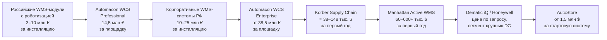

# Сравнительный обзор рынка систем класса WMS / WCS / RMS

Документ сопровождает «Систему лицензирования и стоимость Automacon WCS» и приводит публично доступные данные о ценах и моделях лицензирования сопоставимых решений на трёх рынках: российском, азиатском и западном (Северная Америка и Европа). Источники указаны прямыми ссылками.

**Замечание о ценах.** Точные цены на enterprise-системы класса WMS / WCS / RMS почти всегда формируются «по запросу» — это стандарт корпоративного рынка. Поэтому в таблицах ниже сочетаются:

- **публичные стартовые цены** на сайтах вендоров и реселлеров (где доступны);
- **диапазоны** из независимых обзоров и калькуляторов (TrustRadius, ITQlick, ToolRadar, Kardex и т. п.);
- **публичные кейсы** и статьи в отраслевых изданиях.

Все суммы — оценочные, без учёта внедрения и интеграции, на первое полугодие 2026 года. Курс для конвертации — около 90 ₽ за доллар.

---

## 1. Российский рынок

Российский рынок специализированных WCS / RMS невелик: чаще всего автоматизация роботизированной части реализуется как модуль или надстройка над WMS. Поэтому сравнимы по функциональности с **Automacon WCS** не одиночные продукты, а связки «WMS + специализированная надстройка под роботов / периферию».

| Решение | Класс | Модель лицензирования | Стартовая цена | Источник |
|---|---|---|---|---|
| **Solvo.WMS** | WMS с поддержкой роботизации и интеграции с WCS | Бессрочная лицензия + поддержка | от **140 000 ₽** ($1,5 тыс.) — стартовая базовая стоимость; полная — индивидуально | [picktech.ru](https://picktech.ru/product/solvo-tos/), [solvo.ru](http://solvo.ru/products/solvo-wms/) |
| **Solvo.TOS** | Управление терминалами / складами, в т. ч. с автоматикой | Бессрочная лицензия | от **140 000 ₽** ($1,5 тыс.) — стартовая базовая стоимость | [picktech.ru](https://picktech.ru/product/solvo-tos/) |
| **AXELOT WMS X5** | WMS с подключением периферии и расширенной аналитикой | Подписка (пер-склад + пер-пользователь + пер-устройство) | от **22 500–25 875 ₽/мес** ($250–290) за стартовую конфигурацию; расширенная лицензия — **15 % в год** от розничной стоимости | [axelot.ru](https://www.axelot.ru/product/axelot-wms-x5/price-and-licensing-policy/) |
| **1С-Логистика: Управление складом 3.0** | WMS на платформе «1С:Предприятие» | Бессрочная лицензия | от **38 300 ₽** ($425) клиентская лицензия; от **63 700 ₽** ($710) основная поставка; **с 1 января 2026 г. — НДС 22 %** | [f1soft.ru](https://f1soft.ru/product/logist-uprskl-lic/), [1cgk.ru](https://www.1cgk.ru/product/otraslevye-resheniya/skladskoy-uchyet/) |
| **LogistiX LEAD WMS** (FX / SE / 3PL / QuickStart / Production) | WMS среднего и крупного бизнеса с интеграцией SAP/1С | Бессрочная лицензия + поддержка | **«Цена по запросу»**, открытых ценников нет; сегмент — склады от 2 000 до 140 000 м² | [logx.ru](http://www.logx.ru/), [k-integration.ru](https://k-integration.ru/vendors/logistix/) |
| **EME.WMS / EME.Предприятие** | WMS с интеграцией роботизированного оборудования; в Реестре отечественного ПО | Бессрочная лицензия | По запросу; ориентация на крупные объёмы — до 500 тыс. строк заказов в смену на одном складе | [eme-wms.ru](https://eme-wms.ru/emepredpriyatie), [metrarobotics.ru](https://metrarobotics.ru/catalog/eme-wms-sistema-avtomatizacii-skladskoj-logistiki/) |

### 1.1. Что важно понимать про российский рынок

1. **Стартовые цены 140 000 ₽ и 38 300 ₽ — это входные «коробки» с базовой функциональностью.** Полная промышленная инсталляция на крупном складе у Solvo, LogistiX, EME, Axelot и 1С:WMS на практике уходит в десятки и сотни миллионов рублей с учётом модулей, кастомизации, интеграции и пусконаладки (это нигде не публикуется и согласуется по проекту).
2. **С 1 января 2026 года передача прав на ПО облагается НДС по ставке 22 %** — по данным реселлеров «1С» это уже учтено в новых прайсах. Источник: [1cgk.ru](https://www.1cgk.ru/product/otraslevye-resheniya/skladskoy-uchyet/).
3. **Специализированный сегмент именно WCS / RMS** в России пока представлен слабо: типичные альтернативы — модули WMS-систем или собственные «закрытые» стеки от вендоров роботов (например, Ronavi). Эту нишу Automacon WCS занимает осознанно.

---

## 2. Азиатский рынок

Азиатские игроки — это в первую очередь поставщики роботов с собственным программным стеком (RMS / WCS / WES), часто продающие связку «робот + платформа». Большинство — RaaS-ориентированы.

| Решение | Класс | Модель лицензирования | Стартовая цена | Источник |
|---|---|---|---|---|
| **Geek+ (Geekplus)** Smart Robotics Platform: WES + RMS + IOP | RMS / WCS / WES для парка роботов; до 5 000 роботов на одной системе | Покупка робота + лицензия / RaaS подписка | **Робот**: P800 picking — **$35 000**; S20C sorter — **$18 000**; полные системы (RoboShuttle RS5N) — **от $2 млн**; стоимость отдельной лицензии RMS публично не раскрывается | [robotomated.com](https://robotomated.com/manufacturers/geekplus), [geekplus.com/software](https://www.geekplus.com/software?hsLang=en) |
| **Hai Robotics** (HaiPick System 3 — ACR + AMR) | ASRS + RMS, плотность хранения до 43 000 ёмкостей на 1 000 м² | Покупка системы; ROI калькулятор на сайте | Конкретные цены не публикуются; типичный диапазон по индустрии — **от $300–500 тыс. за систему стартовой конфигурации**, развёртывание 1–2 месяца | [hairobotics.com/products/haipick-system-3](https://www.hairobotics.com/products/haipick-system-3), [ROI calculator](https://www.hairobotics.com/roi-calculator) |
| **6 River Systems** (Chuck) — приобретена Ocado Group | AMR + RMS | RaaS подписка | **«От нескольких сотен до тысячи долларов и более в месяц» за робота** в зависимости от условий; ROI 12–18 мес | [shipscience.com — Dematic vs 6RS](https://www.shipscience.com/dematic-vs-6-river-systems-shopify/), [bestopschainai.com — 6RS FAQs](https://bestopschainai.com/warehouse-inventory/6-river-systems-ocado-robotics-faqs) |

### 2.1. Что важно понимать про азиатский рынок

1. **Ставка на RaaS как основную модель.** Geek+ открыто продвигает Robot-as-a-Service наряду с продажей оборудования (источник: [geekplusrobotics.borealtech.com](https://geekplusrobotics.borealtech.com/en/raas/)). Это фундаментально иная экономика, чем on-premise лицензия: заказчик не владеет ни роботами, ни ПО, платит ежемесячно.
2. **Программная часть «вшита» в продажу железа.** Цена за саму систему управления (RMS / WCS) у Geek+ и Hai Robotics, как правило, не разделена на отдельную строку: ПО включено в стоимость комплексной поставки. Это создаёт зависимость от вендора роботов — при смене бренда нужно менять и платформу.
3. **Полные комплексные системы** (с роботами, инфраструктурой, ПО) — это диапазон от **$300 тыс.** для небольшой ASRS у Hai Robotics до **$2 млн+** для крупной RoboShuttle от Geek+.
4. **Ценовое позиционирование** азиатских игроков на западных рынках — между 0,7× и 1× от ценника Dematic / Honeywell на сопоставимый функционал; в Азии — заметно дешевле.

---

## 3. Западные рынки (Северная Америка и Европа)

Это основная мировая референсная база для enterprise-WMS / WCS / WES. Здесь публичная информация лучше структурирована — есть аналитика Gartner, обзоры TrustRadius, ITQlick, G2.

| Решение | Класс | Модель лицензирования | Стартовая цена | Источник |
|---|---|---|---|---|
| **Manhattan Active Warehouse Management** | Cloud-native WMS, лидер квадранта Gartner WMS 2025 (17-й раз) | Подписка (cloud-native, microservices) | **Annual license $10 000 — $100 000+**, в зависимости от конфигурации; **Implementation $50 000 — $500 000+**; первый год для 10-пользовательского развёртывания — **$60 000 — $600 000+** | [Manhattan / Gartner MQ 2025](https://www.manh.com/resources/research-report/gartner-magic-quadrant-warehouse-management-systems), [ITQlick](https://www.itqlick.com/manhattan-associates-warehouse-management/pricing) |
| **SAP Extended Warehouse Management (EWM)** в S/4HANA | WMS уровня предприятия с MFS | Per-user (≈ $120/мес/пользователь) или per-warehouse для Advanced | **EWM Basic** — включён в S/4HANA без доплат; **EWM Advanced** — **примерно $120 за пользователя в месяц** ($1 440 в год) по публичной справочной информации; в больших инсталляциях — лицензирование на склад | [SAP](https://www.sap.com/products/scm/extended-warehouse-management/pricing.html), [PricingNow](https://pricingnow.com/question/sap-extended-warehouse-management-pricing/), [Rocket Consulting](https://blog.rocket-consulting.com/rocket-sap-supply-chain-news-and-blog/extended-warehouse-management-basic-vs-advanced-with-s4hana) |
| **Körber Supply Chain (бывш. HighJump)** — Warehouse Edge / Advantage | WMS с расширенной интеграцией оборудования | Бессрочная лицензия + 18–22 % M&S | **License $15 000 — $40 000**; **Onboarding/Implementation $20 000 — $100 000+**; **первый год 10-пользовательской инсталляции — $38 000 — $148 000**; интеграция и миграция — отдельно $5 000 — $50 000+ | [ITQlick — HighJump](https://www.itqlick.com/highjump-warehouse-advantage/pricing), [TrustRadius — Körber](https://www.trustradius.com/products/korber-supply-chain-highjump/pricing) |
| **Dematic iQ Optimize** | WES для крупных DC, AI-driven оптимизация | По запросу | Цены публично не раскрыты; по обзорам — «значительные начальные инвестиции», ориентация на enterprise | [TrustRadius — Dematic iQ Optimize](https://www.trustradius.com/products/dematic-iq-optimize/pricing), [bestopschainai.com](https://bestopschainai.com/warehouse-inventory/dematic-overview-and-features) |
| **Honeywell Intelligrated Momentum WES** | Cloud-native WES для DC, оркестровка автоматики | По запросу | Цены публично не раскрыты; описывается как enterprise-решение для крупных распределительных центров | [Honeywell](https://automation.honeywell.com/us/en/software/warehouse-automation/momentum-warehouse-execution-system), [TrustRadius — Momentum WES](https://www.trustradius.com/products/momentum-warehouse-execution-system-wes/pricing) |
| **Locus Robotics** | RaaS-парк AMR с собственной системой управления | Robotics-as-a-Service, ежемесячная подписка | **≈ $1 500/месяц за робота** (по публичным сравнениям) — все включено: робот, ПО, обновления, поддержка | [Robotomated comparison](https://robotomated.com/learn/vs/locus-robotics-vs-6-river-systems), [Volvenix review](https://volvenix.com/tool/locus-robotics) |
| **AutoStore** (поставка через Kardex и других интеграторов) | Cube-based ASRS с собственным WCS | Бессрочная покупка системы | **Стартовая система — от $1,5 млн**; пример из практики: $1 млн инвестиций → $300 тыс. экономии в год; типовой срок окупаемости 3–4 года | [Kardex — AutoStore cost](https://www.kardex.com/en-us/blog/how-much-does-autostore-cost), [Kardex — ASRS prices](https://www.kardex.com/en-us/blog/asrs-cost-factors) |

### 3.1. Что важно понимать про западный рынок

1. **Стандартный M&S — 18–22 % от стоимости лицензии в год.** Это видно у Körber: *«Hidden Fees: $3 000 — $8 000 annually (maintenance & support at 18–22 % of license cost)»* — [ITQlick](https://www.itqlick.com/highjump-warehouse-advantage/pricing).
2. **Затраты на внедрение часто соразмерны стоимости лицензии.** У Manhattan Active: implementation $50 000 — $500 000+ при annual license $10 000 — $100 000+. Это правило большого пальца — «1 ₽ на лицензию = 1–2 ₽ на внедрение и интеграцию».
3. **Первый год развёртывания всегда дороже последующих.** У Manhattan для 10-пользовательской инсталляции — $60 000 — $600 000+ в первый год; у Körber — $38 000 — $148 000.
4. **Публичных цен на Dematic iQ и Honeywell Momentum нет в принципе** — обе системы отнесены TrustRadius к «paid only, contact vendor». Это типично для enterprise-сегмента уровня крупных автоматизированных DC.
5. **AutoStore — это не WCS, а связка ASRS + ПО.** Включена в обзор как ориентир по верхней границе мирового рынка цельных автоматизированных решений: $1,5 млн+ за стартовую систему.
6. **Manhattan Associates — лидер Gartner Magic Quadrant for WMS 2025 в 17-й раз** ([источник](https://www.manh.com/resources/research-report/gartner-magic-quadrant-warehouse-management-systems)), и при этом цены никто не публикует — это окончательно подтверждает, что публичного прайса в премиум-сегменте мирового рынка не существует.

---

## 4. Сводное позиционирование Automacon WCS

**Ключевые наблюдения:**

- **Automacon WCS Starter (3,8 млн ₽ / $42 тыс.)** ниже стартовой цены Körber HighJump ($15 тыс. лицензия + $20 тыс. внедрение = ~$35 тыс. на старт) и сопоставим по функциональности; при этом наша цена включает уровень функциональности, который у Körber требует надстроек.
- **Automacon WCS Professional (14,5 млн ₽ / $161 тыс.)** попадает в нижнюю половину диапазона Manhattan Active и Körber на enterprise-уровне.
- **Automacon WCS Enterprise (38,5 млн ₽ / $428 тыс.)** соответствует средней ценовой точке Manhattan Active для крупных площадок и нижней границе типового ценника Dematic iQ.
- **Multi-Site Enterprise Agreement** (см. документ «Система лицензирования и стоимость Automacon WCS», раздел 8) даёт скидку 30 % при многоплощадочном контракте — это укладывается в мировую практику 20–35 % для multi-site сделок.

---

## 5. Источники в одном месте

Список ключевых ссылок, использованных в документе:

### Россия

- Solvo.WMS / Solvo.TOS: <https://picktech.ru/product/solvo-tos/>, <http://solvo.ru/products/solvo-wms/>, <http://www.solvo.ru/services/tos-implementation/>
- AXELOT WMS X5 — официальный прайс и лицензионная политика: <https://www.axelot.ru/product/axelot-wms-x5/price-and-licensing-policy/>
- 1С-Логистика: Управление складом 3.0: <https://www.1cgk.ru/product/otraslevye-resheniya/skladskoy-uchyet/>, <https://f1soft.ru/product/logist-uprskl-lic/>
- LogistiX LEAD WMS: <http://www.logx.ru/>, <https://k-integration.ru/vendors/logistix/>
- EME.WMS / EME.Предприятие: <https://eme-wms.ru/emepredpriyatie>, <https://metrarobotics.ru/catalog/eme-wms-sistema-avtomatizacii-skladskoj-logistiki/>
- Обзор российских WMS и AGV-систем в условиях санкций: <https://skladmaps.ru/aktualnoe/roboty-na-sklade-kak-avtomatizirovat-raspredelitelnyi-tsentr-v-usloviiah-sanktsii>

### Азия

- Geek+ — продукты и софт: <https://www.geekplus.com/software?hsLang=en>, <https://geekplusrobotics.borealtech.com/en/raas/>
- Geek+ — детальные цены: <https://robotomated.com/manufacturers/geekplus>
- Hai Robotics: <https://www.hairobotics.com/products/haipick-system-3>, <https://www.hairobotics.com/roi-calculator>
- 6 River Systems (Ocado): <https://bestopschainai.com/warehouse-inventory/6-river-systems-ocado-robotics-faqs>, <https://www.shipscience.com/dematic-vs-6-river-systems-shopify/>

### Запад

- Manhattan Active WMS: <https://www.manh.com/resources/research-report/gartner-magic-quadrant-warehouse-management-systems>, <https://www.itqlick.com/manhattan-associates-warehouse-management/pricing>
- SAP EWM: <https://www.sap.com/products/scm/extended-warehouse-management/pricing.html>, <https://pricingnow.com/question/sap-extended-warehouse-management-pricing/>, <https://blog.rocket-consulting.com/rocket-sap-supply-chain-news-and-blog/extended-warehouse-management-basic-vs-advanced-with-s4hana>
- Körber Supply Chain (HighJump): <https://www.itqlick.com/highjump-warehouse-advantage/pricing>, <https://www.trustradius.com/products/korber-supply-chain-highjump/pricing>
- Dematic iQ: <https://www.trustradius.com/products/dematic-iq-optimize/pricing>, <https://bestopschainai.com/warehouse-inventory/dematic-overview-and-features>
- Honeywell Intelligrated Momentum WES: <https://automation.honeywell.com/us/en/software/warehouse-automation/momentum-warehouse-execution-system>, <https://www.trustradius.com/products/momentum-warehouse-execution-system-wes/pricing>
- Locus Robotics: <https://robotomated.com/learn/vs/locus-robotics-vs-6-river-systems>, <https://volvenix.com/tool/locus-robotics>
- AutoStore (через Kardex): <https://www.kardex.com/en-us/blog/how-much-does-autostore-cost>, <https://www.kardex.com/en-us/blog/asrs-cost-factors>

---

## 6. Применимость для Automacon WCS

Этот обзор используется в трёх ситуациях:

1. **При формировании коммерческого предложения** — обоснование цены конкретной сделки ссылками на отраслевые ориентиры.
2. **При работе с возражениями** — ответ на «слишком дорого» через сравнение с международными игроками и обоснование, что Automacon WCS встаёт в нижнюю половину enterprise-диапазона при сопоставимой функциональности.
3. **При работе с тендерами** — приложение «справки о рыночных ценах» для квазигосударственных и государственных заказчиков.

Документ обновляется по мере появления новых публичных данных и при существенных изменениях курса.
